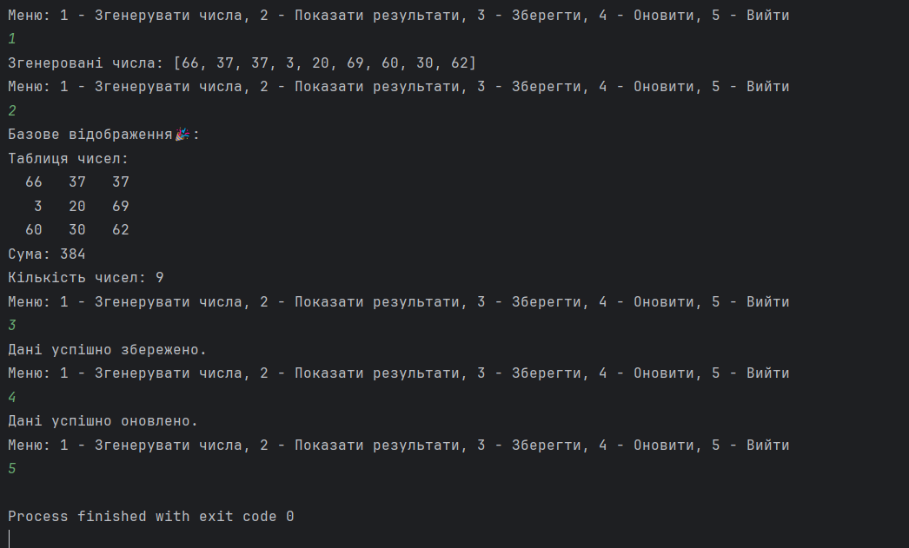

# Завдання 3
## 📌 Завдання
1. Як основа використовувати вихідний текст проекту попередньої лабораторної роботи. Забезпечити розміщення результатів обчислень уколекції з можливістю збереження/відновлення.
2. Використовуючи шаблон проектування Factory Method (Virtual Constructor), розробити ієрархію, що передбачає розширення рахунок додавання нових відображуваних класів.
3. Розширити ієрархію інтерфейсом "фабрикованих" об'єктів, що представляє набір методів для відображення результатів обчислень.
4. Реалізувати ці методи виведення результатів у текстовому виде.
5.  Розробити тареалізувати інтерфейс для "фабрикуючого" методу.
## 📖 Опис
Програма розширює попередній проект, забезпечуючи додаткову функціональність для збереження результатів обчислень у колекції з можливістю серіалізації та відновлення. Використовується шаблон Factory Method для створення різних варіантів відображення результатів обчислень, як на консолі, так і в текстовому файлі.
## 🖼️ Скріншот

## 🔗 Посилання
[Програма]()

## ⚙️ Що робить програма?
✅ Зберігає результати обчислень у колекції та забезпечує їх збереження/відновлення.

✅ Використовує шаблон проектування Factory Method для додавання нових відображуваних класів.

✅ Виводить результати в текстовому вигляді.

✅ Реалізує інтерфейс для фабричного методу для створення відображуваних об'єктів.

