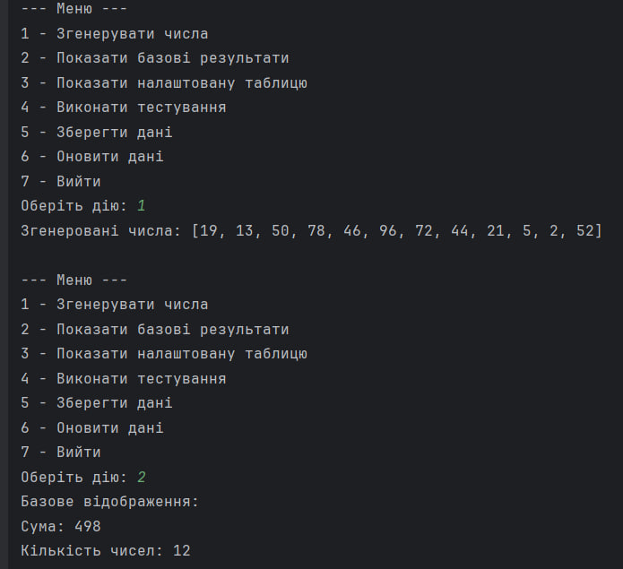
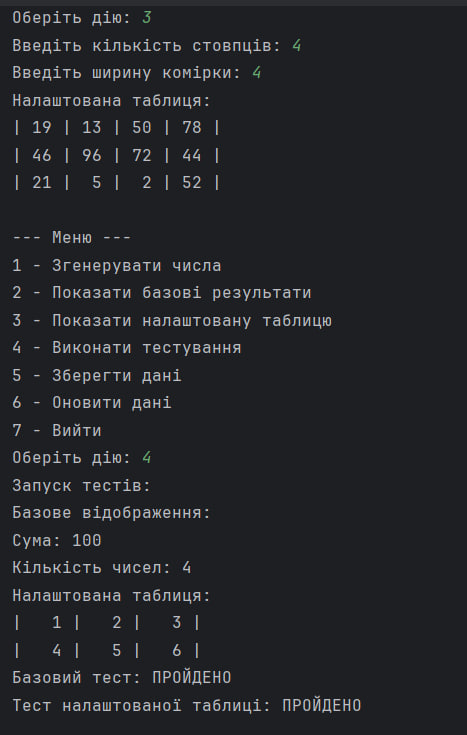
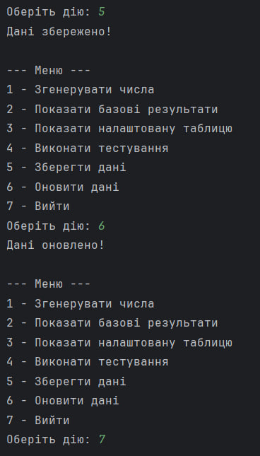

# Завдання 4
## 📌 Завдання
1. За основу використовувати вихідний текст проекту попередньої лабораторної роботи Використовуючи шаблон проектування Factory Method (Virtual Constructor), розширити ієрархію похідними класами, реалізують методи для подання результатів у вигляді текстової таблиці. Параметри відображення таблиці мають визначатися користувачем.
2. Продемонструвати заміщення (перевизначення, overriding), поєднання (перевантаження, overloading), динамічне призначення методів (Пізнє зв'язування, поліморфізм, dynamic method dispatch).
3. Забезпечити діалоговий інтерфейс із користувачем.
4. Розробити клас для тестування основної функціональності.
5. Використати коментарі для автоматичної генерації документації засобами javadoc.
## 📖 Опис
Програма використовує Factory Method для створення класів, що відображають результати обчислень у вигляді таблиці з налаштуванням параметрів. Демонструється заміщення, перевантаження методів та поліморфізм. Має діалоговий інтерфейс для взаємодії з користувачем та клас для тестування. Використовуються коментарі для автоматичної генерації документації через javadoc.
## 🖼️ Скріншот
  

## 🔗 Посилання
[Програма]()

## ⚙️ Що робить програма?
✅ Factory Method для відображення таблиць із налаштовуваними параметрами.

✅ Демонстрація заміщення, перевантаження та поліморфізму.

✅ Діалоговий інтерфейс для взаємодії з користувачем.

✅ Клас для тестування функціональності.

✅ Генерація документації за допомогою javadoc.

