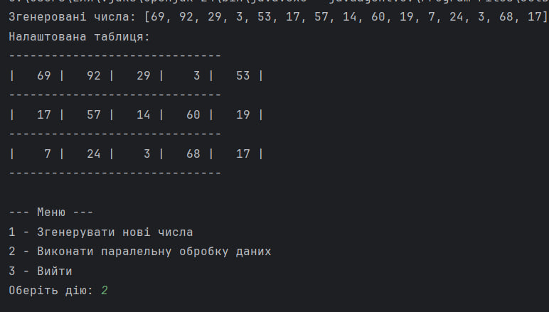
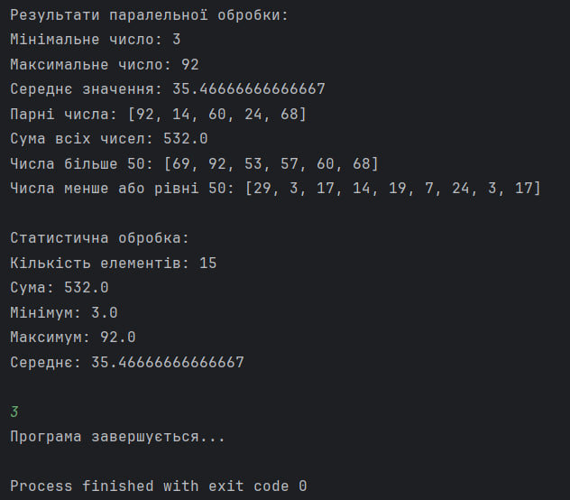

# Завдання 6 - Паралельне виконання
## 📌 Завдання
1. Продемонструвати можливість паралельної обробки елементів колекції (пошук мінімуму, максимуму, обчислення середнього значення, відбір за критерієм, статистична обробка тощо).
2. Управління чергою завдань (команд) реалізувати за допомогою шаблону Worker Thread.
## 📖 Опис
Ця програма реалізує паралельну обробку даних з колекції, використовуючи потоки для обчислень та статистичної обробки. Використовуються Worker Threads для ефективного управління чергою завдань та паралельної обробки. Програма демонструє методи пошуку мінімальних і максимальних значень, обчислення середнього, а також застосування критеріїв для фільтрації елементів.
## 🖼️ Скріншот
 
## 🔗 Посилання
[Програма](https://github.com/ElinaBohomaz/OOP.Bohomaz/blob/main/OOP/src/task6/Main.java)
## ⚙️ Що робить програма?
✅ Паралельно обробляє колекцію для пошуку мінімуму, максимуму, середнього значення і тд.
✅ Використовує шаблон Worker Thread для керування чергою завдань та ефективної обробки.
