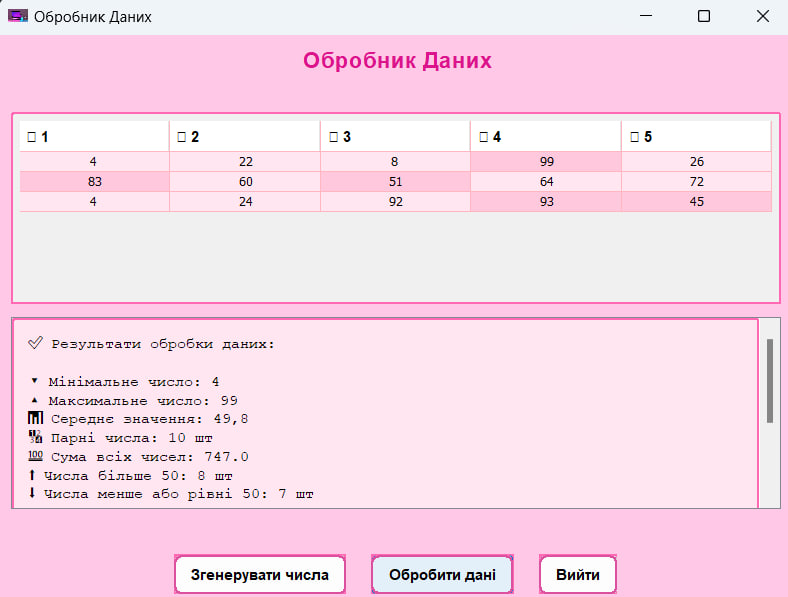
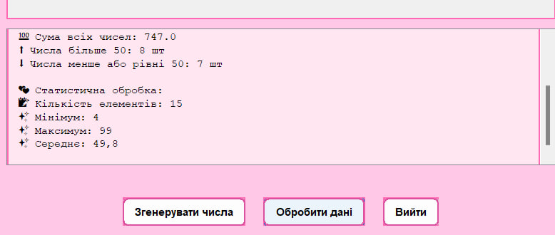

# Завдання 7 - на 5 балів 
## 📌 Завдання
1. Розробити графічний інтерфейс та реалізувати його для попередніх завдань
## 📖 Опис
Графічний інтерфейс застосунок на Java для генерації, візуалізації та обробки випадкових чисел. Застосунок використовує багатопотоковість для асинхронного виконання команд та інтерактивного оновлення UI.
## 🖼️ Скріншот
  
## 🔗 Посилання
[Програма]()
## ⚙️ Що робить програма?
✅ Генерація випадкових чисел у вказаному діапазоні

✅ Відображення чисел у таблиці з кольоровим оформленням

✅ Паралельна обробка даних, включаючи:

  ✏️ Обчислення мінімального та максимального значення;

  ✏️️ Обчислення середнього значення;

  ✏️ Підрахунок суми чисел;

  ✏️ Поділ чисел на парні та непарні;

  ✏️ Розподіл чисел відносно порогового значення (50).

✅ Графічний інтерфейс, оформлений у ніжних рожевих тонах