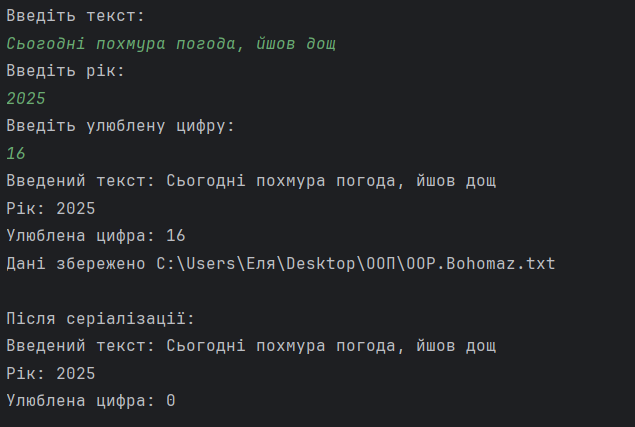
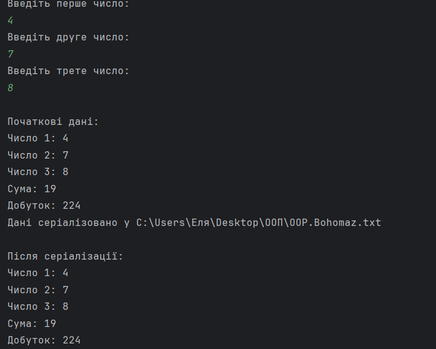
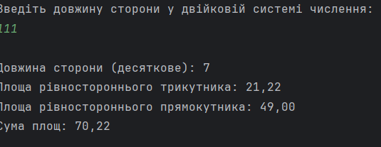

# Богогомаз Еліна - практика з ООП
- **Студентка: Богомаз Еліна**
- **Група: 34**
- **Підгрупа: 1 - Олійник В.В.**
- **Мова: Java**
## Завдання 1
[Завдання](https://github.com/ElinaBohomaz/OOP.Bohomaz/blob/main/OOP/src/task1/Readme.md) 
[/Код](https://github.com/ElinaBohomaz/OOP.Bohomaz/blob/main/OOP/src/task1/Main.java)

> Написати просту консольну програму (наприклад вивід на екран аргументів командної строки)

## Завдання 2
### 2.1
[Завдання](https://github.com/ElinaBohomaz/OOP.Bohomaz/blob/main/OOP/src/task2/readme.md) 
[/Код](https://github.com/ElinaBohomaz/OOP.Bohomaz/blob/main/OOP/src/task2/Main1.java)

> Розробити клас, що серіалізується, для зберігання параметрів і результатів обчислень. Використовуючи агрегування, розробити клас для знаходження рішення задачі.

### 2.2
[Завдання](https://github.com/ElinaBohomaz/OOP.Bohomaz/blob/main/OOP/src/task2/readme.md)
[/Код](https://github.com/ElinaBohomaz/OOP.Bohomaz/blob/main/OOP/src/task2/Main2.java)

> Розробити клас для демонстрації в діалоговому режимі збереження та відновлення стану об'єкта, використовуючи серіалізацію. Показати особливості використання transient полів.

### 2.3
[Завдання](https://github.com/ElinaBohomaz/OOP.Bohomaz/blob/main/OOP/src/task2/readme.md)
[/Код](https://github.com/ElinaBohomaz/OOP.Bohomaz/blob/main/OOP/src/task2/Main3.java)

> Розробити клас для тестування коректності результатів обчислень та серіалізації/десеріалізації. Використовувати докладні коментарі для автоматичної генерації документації засобами javadoc.

### 2.4
[Завдання](https://github.com/ElinaBohomaz/OOP.Bohomaz/blob/main/OOP/src/task2/readme.md)
[/Код](https://github.com/ElinaBohomaz/OOP.Bohomaz/blob/main/OOP/src/task2/Main4.java)

> Визначити суму площ рівностороннього трикутника та рівностороннього прямокутника за заданою довжиною сторони у двійковій системі числення.