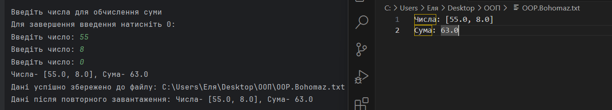
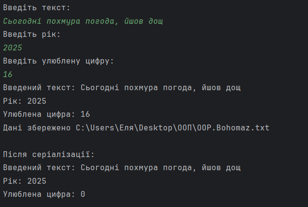
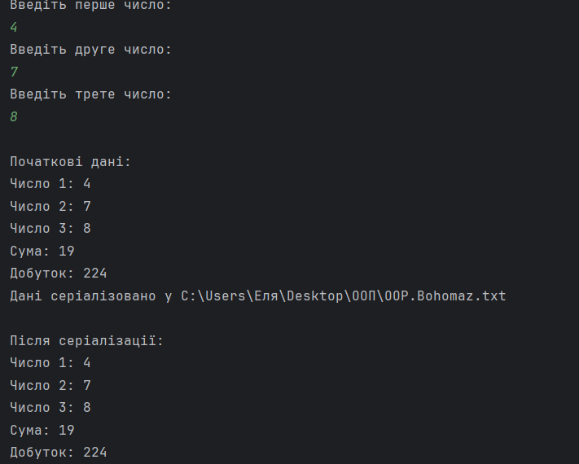
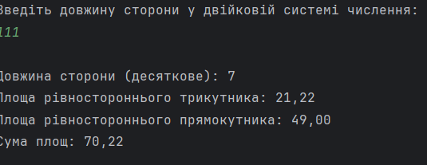

# Завдання 1
## 📌 Завдання
Розробити серіалізований клас для збереження параметрів і результатів обчислень, використовуючи агрегування для пошуку рішення.
## 📖 Опис
Програма реалізує клас, що дозволяє серіалізувати параметри та результати обчислень у файл. Використовується агрегування для ефективного збереження та обробки даних.
## 🖼️ Скріншот

## 🔗 Посилання
[Програма](https://github.com/ElinaBohomaz/OOP.Bohomaz/blob/main/OOP/src/task2/Main1.java)

## ⚙️ Що робить програма?
✅ Зберігає параметри обчислень у файл.

✅ Серіалізує/десеріалізує об'єкти.

✅ Дозволяє знаходити рішення задачі.
# Завдання 2
## 📌 Завдання
Розробити клас для демонстрації збереження та відновлення стану об'єкта у діалоговому режимі, використовуючи серіалізацію. Показати особливості використання transient полів.
## 📖 Опис
Програма демонструє серіалізацію та десеріалізацію об'єктів, а також пояснює використання transient для тимчасових змінних.
## 🖼️ Скріншот

## 🔗 Посилання
[Програма](https://github.com/ElinaBohomaz/OOP.Bohomaz/blob/main/OOP/src/task2/Main2.java)

## ⚙️ Що робить програма?
✅ Дозволяє вводити та зберігати дані об'єкта.

✅ Використовує transient для тимчасових полів.

✅ Відновлює стан об'єкта після збереження.


# Завдання 3
## 📌 Завдання
Розробити клас для тестування коректності результатів обчислень та серіалізації/десеріалізації. Використовувати коментарі Javadoc.
## 📖 Опис
Програма містить набір тестів для перевірки правильності обчислень та коректності роботи з серіалізацією.
## 🖼️ Скріншот

## 🔗 Посилання
[Програма](https://github.com/ElinaBohomaz/OOP.Bohomaz/blob/main/OOP/src/task2/Main3.java)
## ⚙️ Що робить програма?
✅ Виконує тестування математичних операцій.

✅ Перевіряє правильність серіалізації/десеріалізації.

✅ Генерує документацію за допомогою Javadoc.


# Завдання 4
## 📌 Завдання
Визначити суму площ рівностороннього трикутника та рівностороннього прямокутника за заданою довжиною сторони у двійковій системі числення.
## 📖 Опис
Програма обчислює площі двох геометричних фігур та повертає результат у двійковому форматі.
## 🖼️ Скріншот

## 🔗 Посилання
[Програма](https://github.com/ElinaBohomaz/OOP.Bohomaz/blob/main/OOP/src/task2/Main4.java)
## ⚙️ Що робить програма?
✅ Обчислює площу рівностороннього трикутника.

✅ Обчислює площу рівностороннього прямокутника.

✅ Повертає результат у двійковій системі.

# 📘 Теоретичні питання – Основи ООП та серіалізація

## 🔹 Запитання та відповіді

### 1️⃣ Що таке агрегування в ООП?
**Агрегування** – це відношення між класами, коли один клас містить інший як частину, але ця частина може існувати окремо.

### 2️⃣ Що таке агрегація?
**Агрегація** – це слабкий тип зв'язку між класами, коли один клас містить посилання на інший, але може існувати без нього.

### 3️⃣ Що таке композиція?
**Композиція** – це сильніший тип зв'язку, коли один клас містить інший і відповідає за його створення та знищення.

### 4️⃣ Що таке делегування?
**Делегування** – це передача виконання певного завдання іншому об'єкту або методу.

### 5️⃣ Що таке серіалізація?
**Серіалізація** – це процес перетворення об'єкта в потік байтів для збереження або передачі.

### 6️⃣ Як виконується серіалізація/десеріалізація з використанням `Serializable`?
- Об’єктний клас має реалізувати **інтерфейс `Serializable`**.
- Серіалізація:
  ```java
  ObjectOutputStream out = new ObjectOutputStream(new FileOutputStream("data.ser"));
  out.writeObject(object);

